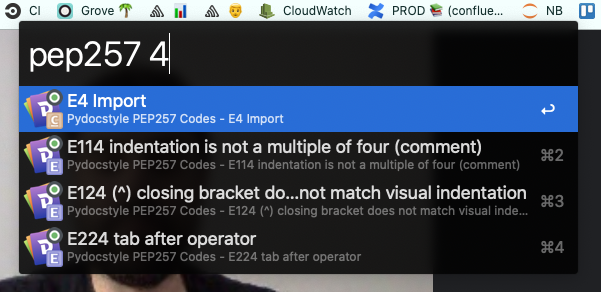

# PEP257 Dash Cheatsheet

A [Dash cheatsheet](https://github.com/Kapeli/cheatsheets) for Pydocstyle & Flake8 codes.

```sh
sudo gem install cheatset
cheatset generate pep257.rb
```


If you use [Alfred](https://www.alfredapp.com/) and the 
[Dash workflow](https://github.com/Kapeli/Dash-Alfred-Workflow) then these will
show up when you enter _pep257 ..._.


